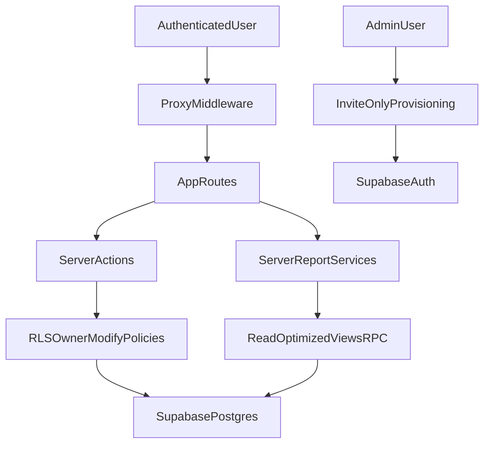

# Rapid-Rollout Architecture Findings and Implementation Plan

## Context and Confirmed Decisions
- **Visibility model:** all authenticated users can read proposals/customers.
- **Mutation model:** only owners (and admins where intended) can modify records.
- **Provisioning model:** invite-only account creation.

These three decisions set the target architecture and remove ambiguity for access-control design.

## Executive Findings

### Strengths
- Clear layered structure (`app routes -> components -> domain libs -> Supabase`) across [`/Users/austin_alexander_guzman/GitHub/Rapid-Rollout/src`](/Users/austin_alexander_guzman/GitHub/Rapid-Rollout/src).
- Strong baseline auth flow in [`/Users/austin_alexander_guzman/GitHub/Rapid-Rollout/src/proxy.ts`](/Users/austin_alexander_guzman/GitHub/Rapid-Rollout/src/proxy.ts) and [`/Users/austin_alexander_guzman/GitHub/Rapid-Rollout/src/lib/supabase/middleware.ts`](/Users/austin_alexander_guzman/GitHub/Rapid-Rollout/src/lib/supabase/middleware.ts).
- Mature migration discipline with drift checks via [`/Users/austin_alexander_guzman/GitHub/Rapid-Rollout/scripts/check-migration-drift.ts`](/Users/austin_alexander_guzman/GitHub/Rapid-Rollout/scripts/check-migration-drift.ts) and CI workflow [`/Users/austin_alexander_guzman/GitHub/Rapid-Rollout/.github/workflows/ci.yml`](/Users/austin_alexander_guzman/GitHub/Rapid-Rollout/.github/workflows/ci.yml).
- Good isolation of business logic in calculation/report libs under [`/Users/austin_alexander_guzman/GitHub/Rapid-Rollout/src/lib`](/Users/austin_alexander_guzman/GitHub/Rapid-Rollout/src/lib).

### Weaknesses and Inefficiencies
- RLS intent is partially implicit; owner-only mutation guarantees rely on policy correctness and convention in server actions (high regression risk if policies drift).
- Invite-only requirement is not fully enforced end-to-end while signup UI exists in [`/Users/austin_alexander_guzman/GitHub/Rapid-Rollout/src/app/(auth)/signup/page.tsx`](/Users/austin_alexander_guzman/GitHub/Rapid-Rollout/src/app/(auth)/signup/page.tsx).
- Report pages are client-heavy and duplicate aggregation pipelines, adding JS/CPU overhead and maintenance cost (e.g., [`/Users/austin_alexander_guzman/GitHub/Rapid-Rollout/src/app/(app)/reports`](/Users/austin_alexander_guzman/GitHub/Rapid-Rollout/src/app/(app)/reports)).
- A correctness risk exists in scenario persistence merge behavior in [`/Users/austin_alexander_guzman/GitHub/Rapid-Rollout/src/components/scenarios/scenario-grid.tsx`](/Users/austin_alexander_guzman/GitHub/Rapid-Rollout/src/components/scenarios/scenario-grid.tsx).
- Security headers are present but CSP remains report-only in [`/Users/austin_alexander_guzman/GitHub/Rapid-Rollout/next.config.ts`](/Users/austin_alexander_guzman/GitHub/Rapid-Rollout/next.config.ts).

### Architectural Risks
- **Access-control regression risk:** if RLS changes unintentionally, app actions can over-authorize writes.
- **Provisioning risk:** if invite-only is not enforced at all entry points, data visibility expands to unauthorized users.
- **Performance risk:** browser-side reporting at scale can degrade UX and increase client compute.

## Target-State Architecture

## Detailed Implementation Plan

### Phase 1: Lock Access Model to Your Policy
- Implement explicit RLS policy checks that preserve **read-all + owner-modify** semantics for proposal/customer-related tables in [`/Users/austin_alexander_guzman/GitHub/Rapid-Rollout/supabase/migrations`](/Users/austin_alexander_guzman/GitHub/Rapid-Rollout/supabase/migrations).
- Add automated policy tests for owner/non-owner/admin mutation paths (must fail closed).
- Add an architecture guard in server actions: central helper that verifies mutating operations are owner/admin-intended before write paths execute.
- Rationale: this turns policy intent into executable guarantees and reduces dependence on individual developer memory.

### Phase 2: Enforce Invite-Only Provisioning End-to-End
- Remove or gate direct self-signup paths in [`/Users/austin_alexander_guzman/GitHub/Rapid-Rollout/src/app/(auth)/signup/page.tsx`](/Users/austin_alexander_guzman/GitHub/Rapid-Rollout/src/app/(auth)/signup/page.tsx).
- Add invite workflow and server-side enforcement (not just UI hiding), using admin-only issuance paths.
- Add integration tests verifying unauthorized self-registration is blocked.
- Rationale: invite-only must be implemented as a backend invariant, not a frontend convention.

### Phase 3: Correctness and Reliability Fixes
- Fix scenario-grid canonical merge behavior in [`/Users/austin_alexander_guzman/GitHub/Rapid-Rollout/src/components/scenarios/scenario-grid.tsx`](/Users/austin_alexander_guzman/GitHub/Rapid-Rollout/src/components/scenarios/scenario-grid.tsx).
- Add targeted tests for concurrent edits and canonical-save merge logic.
- Standardize migration transaction usage for all future multi-statement migrations and backfill high-risk scripts where practical.
- Rationale: this removes silent data inconsistency risk and reduces operational rollback incidents.

### Phase 4: Report Performance and Maintainability
- Move report aggregation from client pages to server-side report services for high-traffic reports first (starting with proposal log).
- Build shared report data contracts in [`/Users/austin_alexander_guzman/GitHub/Rapid-Rollout/src/lib/reports`](/Users/austin_alexander_guzman/GitHub/Rapid-Rollout/src/lib/reports) to eliminate duplicated query/aggregation logic.
- Keep client pages focused on controls/rendering; return pre-aggregated DTOs.
- Rationale: centralizing aggregation cuts client bundle/CPU cost and prevents metric drift between reports.

### Phase 5: Security Hardening and Operational Efficiency
- Promote CSP from report-only to enforce mode in [`/Users/austin_alexander_guzman/GitHub/Rapid-Rollout/next.config.ts`](/Users/austin_alexander_guzman/GitHub/Rapid-Rollout/next.config.ts) after nonce/script compatibility checks.
- Tune proxy matcher/work to reduce unnecessary auth overhead while preserving security guarantees in [`/Users/austin_alexander_guzman/GitHub/Rapid-Rollout/src/proxy.ts`](/Users/austin_alexander_guzman/GitHub/Rapid-Rollout/src/proxy.ts).
- Update onboarding docs to reflect actual auth/proxy runtime behavior in [`/Users/austin_alexander_guzman/GitHub/Rapid-Rollout/README.md`](/Users/austin_alexander_guzman/GitHub/Rapid-Rollout/README.md).
- Rationale: improves baseline security and developer operational accuracy.

## Delivery Order and Success Criteria
- **Order:** Phase 1 -> Phase 2 -> Phase 3 -> Phase 4 -> Phase 5.
- **Security success criteria:** non-owner mutation attempts fail across all protected tables; self-signup blocked in production.
- **Performance success criteria:** report payload size and client compute time measurably reduced; no regression in report correctness.
- **Reliability success criteria:** scenario save-merge tests pass; migration drift checks and policy tests are required CI gates.

## Trade-offs and Direct Challenge
- Keeping **read-all** is acceptable only if your organization is comfortable with internal broad visibility. If this assumption changes later, re-scoping to tenant/team visibility will require policy and query redesign.
- Invite-only is the correct control for your current read-all model. If invite-only weakens, your exposure increases immediately.
- Moving reports server-side adds backend complexity, but it is the right trade for predictable performance and long-term maintainability.
