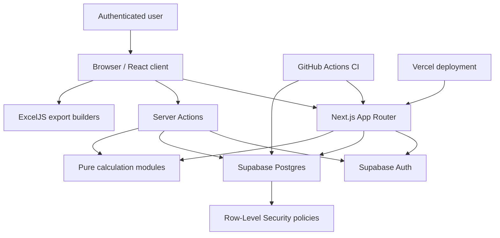
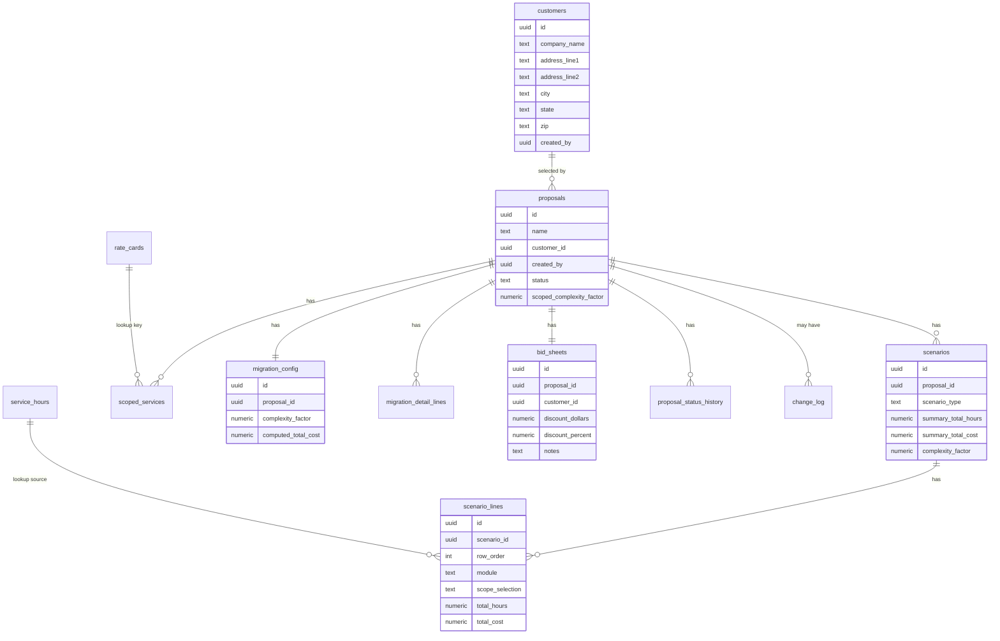
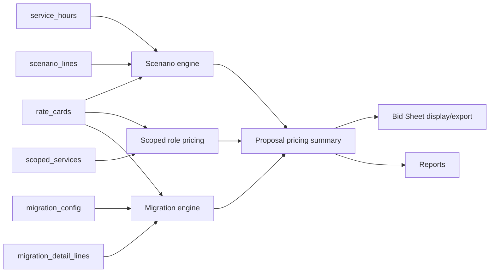
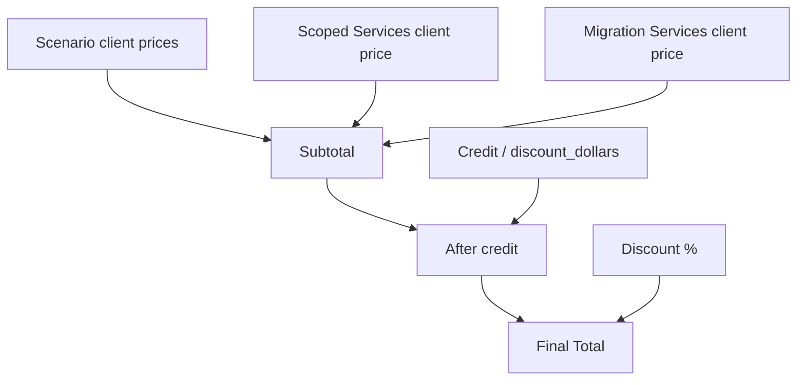
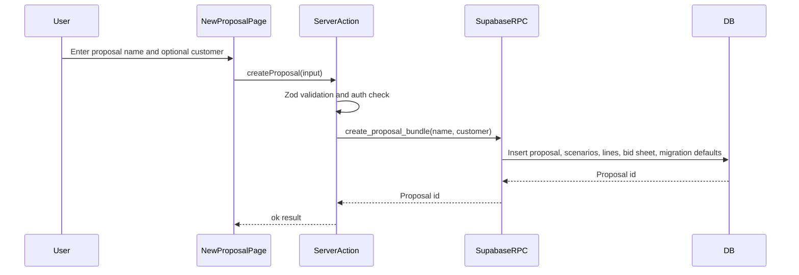
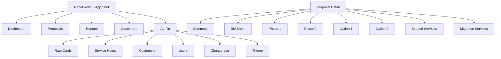
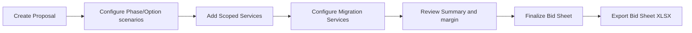
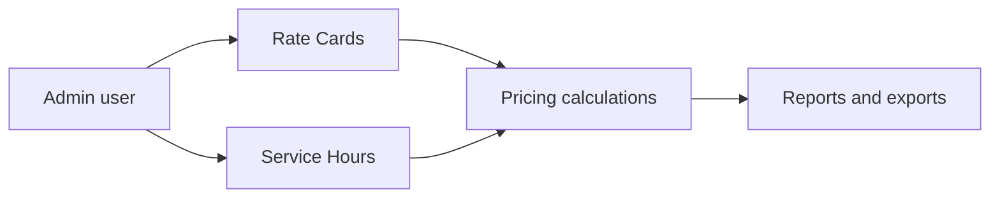
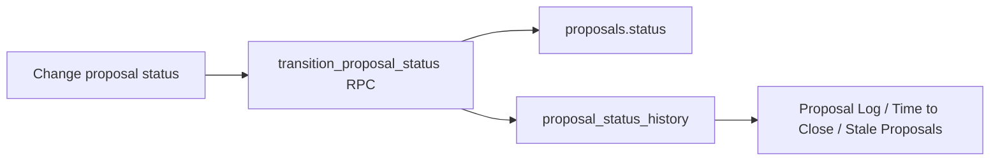

# Rapid Rollout Software Design Document

Last updated: 2026-04-26

## Introduction and overview

### Purpose of this document

This Software Design Document describes the current implemented design of
Rapid Rollout. It is intended for:

- Sales engineering and implementation leadership who need to understand what
  the system does and why it behaves the way it does.
- Developers maintaining the application, pricing rules, database schema,
  reports, exports, and security model.
- Future contributors who need a single design reference before changing
  proposal pricing, Supabase schema, RLS policies, or user workflows.

This document was reverse engineered from the application code, Supabase
migrations, existing technical docs, and the current implemented pricing model.
When this document conflicts with code, treat the conflict as a documentation
defect until the business owner confirms the intended behavior.

### System summary

Rapid Rollout is a proposal scoping and pricing application for replacing a
legacy Excel workbook. The system helps Sales Engineers build implementation
proposals by selecting scope for standard scenarios, adding ad-hoc scoped
services, configuring migration services, reviewing pricing/margin, and
exporting client-facing bid sheets and internal reports.

The application is built with:

| Layer | Technology | Purpose |
| --- | --- | --- |
| Web application | Next.js 16 App Router, React 19 | Authenticated UI, server-rendered pages, client interactions, server actions |
| Database/auth | Supabase Postgres, Supabase Auth, RLS | Data persistence, user identity, row-level security |
| Styling | Tailwind v4, shadcn/ui primitives | Consistent operational UI |
| Validation | Zod | Input validation at form and server-action boundaries |
| Pricing logic | Pure TypeScript calculation modules | Deterministic proposal, scenario, scoped-services, and migration math |
| Spreadsheet export | ExcelJS | Styled XLSX reports and bid sheet export |
| Tests | Vitest | Unit coverage for pricing, persistence helpers, exports, validation, and report helpers |
| CI | GitHub Actions | Typecheck, lint, Vitest with coverage, Next build, migration drift check |

### Business objectives

Rapid Rollout exists to:

1. Replace a multi-tab proposal workbook with a governed web application.
2. Let Sales Engineers scope and price four standard proposal options:
   Phase 1, Phase 2, Option 1, and Option 2.
3. Support additional ad-hoc scoped services.
4. Support migration services with structured migration detail inputs.
5. Calculate client-facing implementation price, internal cost basis, and margin.
6. Use one Complexity Factor model to express contingency pricing.
7. Preserve data integrity through Supabase constraints, RLS, and server-side actions.
8. Produce leadership and sales reports that reconcile with the same pricing rules.
9. Generate client-facing bid sheet exports that hide internal contingency details.

### Project scope

In scope:

- User authentication through Supabase Auth.
- Proposal creation and deletion.
- Customer management.
- Proposal status management and status history.
- Scenario scoping for Phase 1, Phase 2, Option 1, and Option 2.
- Scoped Services line-item entry.
- Migration Services configuration and detail lines.
- Complexity Factor contingency pricing.
- Bid Sheet display, credit, discount, notes, and XLSX export.
- Summary view with discounted margin calculations.
- Admin maintenance of rate cards, service hours, customers, users, change log,
  and theme settings.
- Reports for proposal log, scenario breakout, proposal hours, portfolio value,
  stale proposals, and time to close.
- CI verification and migration drift checking.

Out of scope or deferred:

- A persisted "customer selected this option" decision model across scenarios,
  Scoped Services, and Migration Services.
- Hard blocking enforcement of the 40 percent margin rule. The current rule is
  visual only.
- Automated database migration application during Vercel deploys.
- Multi-environment promotion workflow beyond the existing repo migrations and
  Supabase deployment guidance.
- Real-time collaborative editing.
- External CRM/ERP integrations.

### Primary users

| User type | Responsibilities | Key screens |
| --- | --- | --- |
| Sales Engineer | Create proposals, configure scenarios, scoped services, migration services, bid sheets | Dashboard, Proposals, Proposal tabs |
| Admin | Maintain lookup tables, users, and operational data | Admin section |
| Leadership/Operations | Review pipeline value, stale proposals, time-to-close metrics, hours and revenue reports | Reports |

### Key design principles

1. **Pricing logic lives in shared pure functions.** UI components should call
   calculation helpers instead of reimplementing math.
2. **Fail closed for pricing-critical data.** Missing required rate-card rows
   should produce an error instead of a silently incorrect zero.
3. **Server actions validate and authorize.** Client UI is not a security
   boundary.
4. **RLS is the database security backstop.** Proposal-related tables use
   row-level policies to enforce read/write rules even if an API path is called
   directly.
5. **Database schema changes are operational changes.** Migrations must be
   applied to Supabase before app code that depends on them is smoke tested.
6. **Reports must reconcile to shared pricing.** Proposal Summary, Bid Sheet,
   and report helpers should use the same aggregation concepts.

## System architecture

### High-level architecture



### Runtime architecture

Rapid Rollout uses the Next.js App Router with two route groups:

| Route group | Purpose |
| --- | --- |
| `src/app/(auth)` | Login and signup pages |
| `src/app/(app)` | Authenticated application shell, dashboard, proposals, reports, customers, admin |

The global request proxy in `src/proxy.ts` calls
`src/lib/supabase/middleware.ts` to refresh Supabase sessions and redirect:

- Unauthenticated users attempting to access app pages are redirected to
  `/login`.
- Authenticated users attempting to access `/login` or `/signup` are redirected
  to `/dashboard`.

Server Components use `src/lib/supabase/server.ts` to create a Supabase client
bound to the current request cookies. Client Components use the singleton
browser client in `src/lib/supabase/client.ts`.

### Application layers

| Layer | Main paths | Responsibilities |
| --- | --- | --- |
| Route/page layer | `src/app/(app)`, `src/app/(auth)` | Page composition, data loading, route-level decisions |
| UI component layer | `src/components` | Reusable UI pieces for admin tables, proposal nav, scenario grid, migration forms, summary tables |
| Server action layer | `src/app/**/actions.ts`, `src/components/admin/actions.ts` | Mutations, validation, auth checks, revalidation |
| Domain logic layer | `src/lib/calculations`, `src/lib/reports`, `src/lib/migration`, `src/lib/scenarios` | Pricing engines, report aggregation, persistence helpers |
| Data access layer | `src/lib/supabase`, Supabase client calls | Supabase clients, required-rate fetchers, typed queries |
| Validation layer | `src/lib/validation` | Zod schemas for user-controlled input and Supabase response parsing |
| Database layer | `supabase/migrations`, `src/types/database.ts` | Tables, RLS, indexes, RPCs, generated TypeScript database types |

### Major components and responsibilities

| Component | Responsibility |
| --- | --- |
| App shell | Provides sidebar navigation, admin nav visibility, and page container layout |
| Auth middleware | Refreshes session cookies and enforces login redirects |
| Proposal layout | Loads proposal header, status control, delete control, and proposal tabs |
| Scenario grid | Lets users select scope per module and persists canonical scenario lines |
| Scoped Services page | Manages ad-hoc service lines, raw hours, adjusted hours, cost, and role-based contingency summary |
| Migration Services page | Manages migration config, detail rows, services/hours summary, and cost summary |
| Bid Sheet page | Presents client-facing implementation price, credit, discount, notes, and XLSX export |
| Summary page | Compares scenarios, Scoped Services, Migration Services, discounted cost, client price, and margin |
| Reports | Provide proposal log, scenario breakout, hours, portfolio value, stale proposal, and time-to-close views |
| Admin data table | Generic editable table UI for rate cards, service hours, and customers |

### Architectural style

Rapid Rollout is a layered, server-rendered web application with:

- React Client Components for rich editable UI.
- Next.js Server Components for authenticated data reads.
- Server Actions for mutations.
- Supabase Postgres as the system of record.
- RLS policies as the database-side authorization boundary.
- Pure TypeScript domain modules for pricing and report math.

The design intentionally avoids putting pricing math directly into UI
components except for small display calculations. This keeps pricing testable
and lets Summary, Bid Sheet, reports, and exports reconcile to shared behavior.

### Key design decisions and trade-offs

| Decision | Why it was chosen | Trade-off |
| --- | --- | --- |
| Supabase Auth + Postgres + RLS | Keeps identity, data, policies, and app data in one platform | Requires careful migration coordination |
| Server actions for mutations | Co-locates mutation logic with app routes and enables typed validation | Actions must explicitly re-check auth because UI gates are not security |
| Pure calculation modules | Pricing can be unit tested and reused across views | Requires discipline to avoid duplicating math in components |
| Atomic Postgres RPCs for proposal bootstrap and status transition | Prevents half-created proposals and status/history drift | RPC migrations must be deployed before dependent code |
| Global authenticated read for proposals | Supports Sales Engineer backup workflow | Write policies must be tighter to prevent unauthorized edits |
| One Complexity Factor as contingency model | Makes CF affect client price without inflating internal cost | Requires careful explanation in UI because total hours include contingency |
| ExcelJS dynamic import | Keeps XLSX dependency out of initial browser bundle | Export code lives client-side and must be tested through browser smoke tests |

### Deployment and CI architecture

The CI workflow runs on pull requests and pushes to `main`:

| Job | Purpose |
| --- | --- |
| Lint and typecheck | Runs `npx tsc --noEmit` and `npm run lint` |
| Vitest | Runs `npx vitest run --coverage` and uploads coverage artifact |
| Next build | Runs `npx next build` with placeholder public Supabase env vars |
| Migrations drift | Uses `SUPABASE_DB_URL` to compare repo migration history to the target database |

Application code deploys through the GitHub/Vercel path. Supabase schema
changes do not automatically deploy with Vercel. Schema migrations must be
applied to the target Supabase project before smoke testing code that depends
on them.

## Data design

### Data storage overview

Supabase Postgres is the source of truth. The schema is managed through ordered
SQL migrations in `supabase/migrations`. `src/types/database.ts` stores the
generated TypeScript view of the database schema.

Important data categories:

| Category | Tables |
| --- | --- |
| Lookup/config | `rate_cards`, `service_hours` |
| Customer/proposal | `customers`, `proposals` |
| Scenario pricing | `scenarios`, `scenario_lines` |
| Scoped Services | `scoped_services` |
| Migration Services | `migration_config`, `migration_detail_lines` |
| Bid Sheet | `bid_sheets` |
| Audit/status | `change_log`, `proposal_status_history` |

The historical `migration_services` table was created early but later dropped
because it was unused and empty. Current migration pricing uses
`migration_config` and `migration_detail_lines`.

### Entity relationship overview



### Table design

#### `rate_cards`

Stores hourly rates and fixed pricing lookup rows.

Important columns:

| Column | Purpose |
| --- | --- |
| `rate_card_name` | Logical rate card grouping, currently commonly `Master` |
| `activity` | Human-readable rate activity |
| `rate` | Numeric rate used by pricing calculations |
| `role_category` | Role group such as Sr. IM, PM, BA, Travel, Internal |
| `status` | Active/inactive control |
| `lookup_key` | Unique key used by app logic, for example `Master|Sr. Implementation Manager` |

Critical lookup keys include:

- `Master|Sr. Implementation Manager`
- `Master|Program Manager`
- `Master|Business Analyst`
- `Master|Travel Cost/Trip`
- `Master|Internal Cost Rate`

#### `service_hours`

Stores standard implementation scope options. Scenario lines use this table as
the source for role hours.

Important columns:

| Column | Purpose |
| --- | --- |
| `service_name` | Scenario module name |
| `scope_value` | User-selected scope value |
| `sr_im_hours`, `pm_hours`, `ba_hours` | Base role hours for the module/scope pair |
| `scope_label` | Display label for the scope |
| `service_group` | Grouping for module organization |
| `status` | Active/inactive control |
| `lookup_key` | Unique key in `ServiceName|ScopeValue` format |
| `sort_order` | Optional ordering field for UI/report display |

#### `customers`

Stores customer identity and address information. Customers are shared across
the authenticated team. Customer edits are audited through change-log triggers.

Important columns:

| Column | Purpose |
| --- | --- |
| `company_name` | Primary customer display name |
| `address_line1`, `address_line2`, `city`, `state`, `zip` | Bid Sheet and export address |
| `created_by` | User that created the customer row, used by RLS for some write rules |

#### `proposals`

Top-level proposal container.

Important columns:

| Column | Purpose |
| --- | --- |
| `name` | Proposal name |
| `customer_id` | Optional selected customer |
| `created_by` | Owner used for write authorization |
| `status` | Current lifecycle status |
| `notes` | Proposal notes |
| `scoped_complexity_factor` | Complexity Factor for Scoped Services |

#### `scenarios`

One proposal normally has four scenario rows:

- `P1`, displayed as Phase 1
- `P2`, displayed as Phase 2
- `Opt1`, displayed as Option 1
- `Opt2`, displayed as Option 2

Important columns:

| Column | Purpose |
| --- | --- |
| `scenario_type` | Internal code constrained to `P1`, `P2`, `Opt1`, `Opt2` |
| `summary_total_hours` | Stored base total hours from current scenario lines |
| `summary_total_cost` | Stored base total cost from current scenario lines |
| `complexity_factor` | Scenario-specific contingency multiplier |
| `is_active` | Legacy/current scenario flag not currently displayed on Summary |

#### `scenario_lines`

Stores the editable grid rows for each scenario. Each row corresponds to a
standard module and selected scope.

Important columns:

| Column | Purpose |
| --- | --- |
| `row_order` | Display order |
| `module` | Standard service module name |
| `scope_selection` | Selected scope value |
| `sr_im_hours`, `pm_hours`, `ba_hours` | Base role hours |
| `sr_im_cost`, `pm_cost`, `ba_cost` | Base role costs |
| `total_hours`, `total_cost` | Base totals before Complexity Factor |
| `is_locked` | Reserved lock flag |

Scenario saves rebuild canonical line values from `service_hours` and
`rate_cards`, then persist line values and scenario summary totals.

#### `scoped_services`

Stores ad-hoc services outside the standard scenario grid.

Important columns:

| Column | Purpose |
| --- | --- |
| `service_type` | Controlled service type |
| `description` | User-entered description |
| `hours` | Raw base hours |
| `rate_card_lookup_key` | Rate card role/rate selector |
| `cost` | Base cost before Scoped Services Complexity Factor |
| `row_order` | Display order |

Scoped Services display raw hours, adjusted hours, cost, and role-grouped
contingency summary.

#### `migration_config`

One row per proposal containing the Migration Services configuration.

Important columns:

| Column | Purpose |
| --- | --- |
| `num_projects` | Project count used by project data migration rows |
| `hrs_per_import` | Hours per import file |
| `lines_per_import_file` | Import file capacity |
| `is_effort_included` | Includes core migration effort hours |
| `is_workshop_included` | Includes migration workshop hours |
| `complexity_factor` | Single migration contingency multiplier |
| `sr_im_trips`, `pm_trips` | Travel labor trip counts |
| `doc_avg_mb_per_project`, `doc_mb_per_hour` | Document migration calculation parameters |
| `core_*_hrs` | Editable core effort hour assumptions |
| `computed_total_cost` | Stored snapshot of current migration client price |

Travel labor hours are billable service time. Travel expense is separate T&E
planning information and does not enter client price.

#### `migration_detail_lines`

Stores project, workflow, and cost migration detail rows.

Important columns:

| Column | Purpose |
| --- | --- |
| `section` | `project`, `workflow`, or `cost` |
| `label` | Row label |
| `quantity` | Object count / project count / average per project |
| `items_per_object` | Line-item density |
| `total_line_items` | Stored total line items |
| `row_order` | Display order within section |

The app computes effective total line items as `quantity * items_per_object`.
For project section rows, project count can override quantity.

#### `bid_sheets`

Stores Bid Sheet adjustments and notes. Scenario/scoped/migration pricing is
computed live from source tables.

Important columns:

| Column | Purpose |
| --- | --- |
| `proposal_id` | One bid sheet per proposal |
| `customer_id` | Customer snapshot/reference for bid sheet |
| `discount_dollars` | Credit applied before percent discount |
| `discount_percent` | Percent discount applied after credit |
| `notes` | Bid sheet notes |

Older p1/p2/option hour/cost snapshot columns exist historically, but current
display and export compute prices from current scenario, scoped, and migration
state.

#### `proposal_status_history`

Stores status transitions for reporting.

Important columns:

| Column | Purpose |
| --- | --- |
| `proposal_id` | Parent proposal |
| `old_status` | Previous status |
| `new_status` | New status |
| `changed_by` | User who changed status |
| `changed_at` | Transition timestamp |

The `transition_proposal_status` RPC updates `proposals.status` and inserts
history atomically.

#### `change_log`

Stores audit events.

Important columns:

| Column | Purpose |
| --- | --- |
| `proposal_id` | Optional parent proposal |
| `table_name` | Table affected |
| `record_id` | Record affected |
| `action` | Insert, update, delete, or domain action |
| `changed_by` | Server-stamped user |
| `old_values`, `new_values` | JSONB snapshots |

Customer table changes are auto-logged through triggers. Proposal deletion also
writes an audit record before deletion.

### Pricing data flow



### Complexity Factor and contingency model

The current design treats Complexity Factor as a contingency multiplier:

| Concept | Rule |
| --- | --- |
| Base hours | Original scoped/scenario/migration labor hours before Complexity Factor |
| Contingency hours | `base hours * (complexity_factor - 1)` |
| Client Price | Base cost + contingency cost |
| Internal Cost | Base labor hours only * internal cost rate |
| Margin | `(client price - internal cost) / client price` |
| Travel expense | Separate T&E estimate, not part of firm implementation price |

This model is implemented in `src/lib/calculations/contingency-pricing.ts` and
used by:

- Scenario cost summaries
- Scoped Services cost summary
- Migration Services cost summary
- Proposal Summary margin display
- Bid Sheet and reports through shared totals

### Bid Sheet adjustment data flow



Formula:

```text
subtotal = scenario_total + scoped_services_total + migration_total
after_credit = max(0, subtotal - credit)
final_total = after_credit * (1 - discount_percent / 100)
```

### Data validation and integrity rules

| Rule type | Implementation |
| --- | --- |
| UUID and input validation | Zod schemas in `src/lib/validation` |
| Discount dollars | Non-negative Zod validation and database constraints |
| Discount percent | 0 to 100 Zod validation and database constraints |
| Complexity Factor | 0.50 to 9.99 server validation and database checks |
| Scenario type | Database CHECK constraint for `P1`, `P2`, `Opt1`, `Opt2` |
| Proposal bootstrap | Atomic `create_proposal_bundle` Postgres RPC |
| Status transition integrity | Atomic `transition_proposal_status` Postgres RPC |
| Rate-card completeness | `fetchRequiredRates` fail-closed helper |
| Audit integrity | `changed_by` server-side trigger and RLS check |
| Child cleanup | `ON DELETE CASCADE` from proposals to children |

### Data retrieval strategy

Rapid Rollout uses a mix of server-side data reads and client-side data reads:

- Server-rendered pages load initial data through `createClient()` from
  `src/lib/supabase/server.ts`.
- Client pages that support live editing use `src/lib/supabase/client.ts`.
- Server actions reload affected rows after writes and return canonical state.
- `revalidatePath` is used after server actions to refresh affected pages.
- Some read-mostly pages use `revalidate` instead of `force-dynamic` to reduce
  unnecessary Supabase calls.

## Interface design

### External interfaces

| External system | Interface | Usage |
| --- | --- | --- |
| Supabase Auth | `@supabase/ssr`, browser and server clients | Sign in, sign out, session refresh, role metadata |
| Supabase Postgres | Supabase JS queries and RPC calls | All app data persistence and retrieval |
| Supabase RLS | Database policies | Authorization enforcement |
| GitHub Actions | `.github/workflows/ci.yml` | CI verification |
| Vercel | Next.js deployment target | Hosts application code |
| Excel clients | XLSX files generated by ExcelJS | Bid Sheet and reports |

### Internal interfaces

#### Supabase client interface

| Helper | Path | Purpose |
| --- | --- | --- |
| `createClient` server | `src/lib/supabase/server.ts` | Creates request-cookie-bound Supabase server client |
| `createClient` browser | `src/lib/supabase/client.ts` | Creates stable browser Supabase client singleton |
| `updateSession` | `src/lib/supabase/middleware.ts` | Refreshes auth sessions and handles auth redirects |
| `fetchRequiredRates` | `src/lib/supabase/queries.ts` | Loads required rate-card rows or returns fail-closed error |

#### Server action interface

Server actions return discriminated result objects rather than throwing user
errors directly:

```ts
type Result =
  | { ok: true; ... }
  | { ok: false; error: string };
```

Major action groups:

| Action group | Path | Responsibilities |
| --- | --- | --- |
| New proposal | `src/app/(app)/proposals/new/actions.ts` | Validates proposal input and calls `create_proposal_bundle` |
| Proposal actions | `src/app/(app)/proposals/[id]/actions.ts` | Status transitions, scenario factor updates, scoped factor updates, scenario grid saves, delete proposal |
| Bid Sheet actions | `src/app/(app)/proposals/[id]/bid-sheet/actions.ts` | Credit, discount percent, notes, customer update action retained for compatibility |
| Scoped Services actions | `src/app/(app)/proposals/[id]/scoped-services/actions.ts` | Add/update/delete scoped lines |
| Migration actions | `src/app/(app)/proposals/[id]/migration/actions.ts` | Add/remove migration detail rows and recompute stored migration total |
| Admin actions | `src/components/admin/actions.ts` | Add/update/delete admin table rows |

Each sensitive server action uses one or more of:

- Zod input validation.
- `assertAuthenticated()`.
- `assertAdmin()`.
- Supabase RLS policies.
- Follow-up row reload after mutation.
- `revalidatePath()` for affected routes.

#### Postgres RPC interface

| RPC | Inputs | Output | Purpose |
| --- | --- | --- | --- |
| `create_proposal_bundle` | `p_name text`, `p_customer_id uuid?` | Proposal UUID | Creates proposal, four scenarios, scenario lines, bid sheet, migration config, and default migration detail lines atomically |
| `transition_proposal_status` | `p_proposal_id uuid`, `p_new_status text` | Boolean changed flag | Updates proposal status and inserts status history atomically |
| `save_scenario_grid` | Scenario id, line payload, summary totals | Boolean | Persists scenario grid lines and summary totals atomically |

The application assumes these functions exist in the target Supabase database.
If code is deployed before migrations, Supabase schema-cache errors will occur.

### Error handling interface

| Error category | Handling pattern |
| --- | --- |
| Auth missing | Middleware redirects or server action returns `ok: false` |
| Admin denied | Admin layout redirects or action returns admin-required message |
| Missing rate cards | Pricing UI blocks with error card; calculations do not default to zero for required rates |
| Missing proposal child rows | Page renders unavailable/error card rather than self-healing silently |
| Invalid form input | Zod returns user-readable validation message |
| Supabase mutation error | Server action returns `ok: false` with Supabase error message |
| Export generation | Browser dynamic import creates XLSX; user smoke testing verifies downloaded workbook |

### Security and authentication design

Authentication is provided by Supabase Auth. Authorization is split into:

1. **Route gating:** middleware redirects unauthenticated users.
2. **UI gating:** admin nav and admin pages hide or redirect for non-admins.
3. **Server action gating:** server actions call `assertAuthenticated()` or
   `assertAdmin()`.
4. **Database gating:** RLS policies enforce read/write rules at the data layer.

Client-side admin checks are not trusted as security. The code comments
explicitly treat `useAuth().isAdmin` and `useRequireAdmin()` as UI-only helpers.
The trusted boundary is server-side user verification plus RLS.

### Message and data formats

| Interface | Format |
| --- | --- |
| Supabase queries | Typed JSON objects returned by Supabase JS |
| Server action inputs | Plain TypeScript objects validated by Zod |
| Server action outputs | Discriminated union result objects |
| Scenario grid RPC payload | JSON array of canonical scenario line updates |
| Audit snapshots | JSONB `old_values` and `new_values` |
| Spreadsheet export | `.xlsx` binary generated by ExcelJS |

## Component design

### Calculation components

#### `src/lib/calculations/engine.ts`

Responsibilities:

- Build lookup maps for service hours and rate cards.
- Calculate scenario line base hours and base costs.
- Calculate scenario totals.
- Apply scenario Complexity Factor.
- Calculate scenario contingency summaries.
- Format currency and hours for UI.

Inputs:

- Scenario line module and scope selection.
- Active service hours rows.
- Active rate card rows.
- Scenario Complexity Factor.
- Internal cost rate for margin.

Outputs:

- Role-level hours and costs.
- Total hours and total cost.
- Role-level contingency summary.

#### `src/lib/calculations/contingency-pricing.ts`

Responsibilities:

- Normalize the shared contingency pricing model.
- Calculate base hours, contingency hours, total client hours.
- Calculate base cost, contingency cost, client price, internal cost.
- Calculate margin percent.
- Sum role-level breakouts into section-level summary.
- Allocate discounted margin after Bid Sheet credit/discount allocation.

This helper is central to the current business rule that Complexity Factor
adds client-facing contingency without increasing internal cost basis.

#### `src/lib/calculations/migration-engine.ts`

Responsibilities:

- Compute migration detail line imports and hours.
- Compute document migration hours.
- Compute core effort, workshop, project, workflow, cost, document, and travel
  labor hours.
- Apply one migration Complexity Factor.
- Separate travel expense from client implementation price.
- Produce role-level pricing breakouts, client price, blended rate, internal
  cost, and margin.

Important processing rules:

- `numImports = 0` when total line items is zero.
- Otherwise, imports use at least two files and round up by
  `lines_per_import_file`.
- Travel labor hours are billable.
- Travel expense is T&E planning-only and remains outside client price.

#### `src/lib/calculations/bid-sheet-pricing.ts` and `proposal-pricing.ts`

Responsibilities:

- Combine scenario, Scoped Services, and Migration Services totals.
- Apply credit before percent discount.
- Floor adjusted totals at zero.
- Produce final proposal total used by Bid Sheet and Summary allocation.

### Proposal components

#### Proposal creation

Flow:



Design reason:

Proposal creation touches multiple tables. The system uses a database RPC so a
new proposal is either fully bootstrapped or not created at all.

#### Proposal status

The proposal status control calls `updateProposalStatus`, which delegates to
the `transition_proposal_status` RPC. This avoids split-write drift where the
proposal status changes but the history row fails.

#### Proposal deletion

Proposal deletion uses:

- Auth check.
- Typed confirmation phrase.
- Optional justification.
- Change log insert.
- Delete with RLS enforcing ownership/admin rules.
- Cascading child deletes through foreign keys.

### Scenario grid component

Path: `src/components/scenarios/scenario-grid.tsx`

Responsibilities:

- Render the standard module grid.
- Load scope options by module.
- Allow users to choose scope values.
- Calculate local display values immediately.
- Debounce saves.
- Persist canonical line values through `saveScenarioGridSelections`.
- Display total row and Cost Summary contingency box.

Important design choices:

- Client-side edits are optimistic but canonical data comes back from the
  server action.
- Server action validates that changed line ids belong to the target scenario.
- The server rebuilds calculations from active service hours and rate cards.
- Scenario totals are stored on the `scenarios` row for faster summary/report
  aggregation.

### Scoped Services component

Path: `src/app/(app)/proposals/[id]/scoped-services/page.tsx`

Responsibilities:

- Render ad-hoc service lines.
- Support service type, description, hours, and rate-card selection.
- Show raw hours and adjusted hours.
- Recalculate base cost from selected rate card.
- Apply proposal-level `scoped_complexity_factor`.
- Display role-grouped contingency summary with blended billing rate and margin.

Processing logic:

- Base hours come from `scoped_services.hours`.
- Base cost comes from `hours * selected rate`.
- Adjusted hours and client price apply Scoped Services Complexity Factor.
- Role grouping uses rate-card lookup keys for Sr. IM, PM, and BA.

### Migration Services component

Paths:

- `src/app/(app)/proposals/[id]/migration/page.tsx`
- `src/components/migration/migration-config-form.tsx`
- `src/components/migration/migration-detail-section.tsx`
- `src/components/migration/migration-totals-summary.tsx`

Responsibilities:

- Load migration config, detail lines, and required rate cards.
- Block page rendering when pricing-critical rates are missing.
- Support config fields for projects, import assumptions, workshop/core effort,
  document migration, travel, and Complexity Factor.
- Render project/workflow/cost detail sections.
- Add/remove migration detail rows.
- Compute Services & Hours Summary.
- Render Cost Summary with role breakouts, blended billing rate, margin, and
  separate T&E estimate.

Persistence:

- Config edits are managed by `useMigrationConfig`.
- Add/remove row actions reload lines, resequence rows, recompute totals, update
  `computed_total_cost`, and revalidate paths.

### Bid Sheet component

Path: `src/app/(app)/proposals/[id]/bid-sheet/page.tsx`

Responsibilities:

- Load bid sheet adjustments, customer, scenarios, scoped totals, migration
  totals, proposal scoped Complexity Factor, and rate cards.
- Display customer information read-only.
- Display line items with client-facing prices only.
- Allow credit, discount percent, and notes edits.
- Export a client-facing Bid Summary workbook.

Bid Sheet export:

- Uses a dynamic `exceljs` import.
- Exports customer name, customer address, Phase 1/2, Option 1/2, Scoped
  Services, Migration Services, Subtotal, Credit, Discount, Final Total, Notes.
- Does not include internal hours, contingency breakout, margin, or internal
  cost.
- Uses report styling consistent with other workbook exports:
  title fill `C1C1DE`, header fill `D5D6E9`, alternate fill `EAEAF4`.

### Summary component

Path: `src/app/(app)/proposals/[id]/page.tsx`

Responsibilities:

- Compare proposal line items across scenarios, Scoped Services, and Migration
  Services.
- Show total billable hours including contingency.
- Show discounted cost allocation.
- Show client price.
- Show margin badge using green/yellow/red visual thresholds.

Margin visual thresholds:

| Threshold | Badge intent |
| --- | --- |
| `>= 40%` | Green |
| `> 30% and < 40%` | Yellow |
| `<= 30%` | Red |

No hard save/blocking enforcement exists for margin.

### Report components

Reports are page-level Client Components with shared helper modules for
aggregation. Reports use Supabase reads, helper maps, and ExcelJS where export
is available.

| Report | Purpose |
| --- | --- |
| Proposal Log | Proposal-level value by status/customer with scenario, scoped, migration, grand total, and status dates |
| Scenario Breakout | Detailed proposal breakout by scenario module, scoped service line, and migration service line |
| Proposal Hours | Role hours by proposal and line item |
| Portfolio Value | Pipeline value grouped by status, excluding terminal statuses as configured |
| Stale Proposals | In-flight proposals with days in current status, red beyond threshold |
| Time to Close | Days from Proposal Sent to Won/Lost |

Shared report helpers:

- `src/lib/reports/proposal-aggregates.ts`
- `src/lib/reports/status-history.ts`
- `src/lib/reports/migration-breakdown.ts`
- `src/lib/exports/scenario-breakout.ts`

### Admin components

Admin table design uses one generic editable table with table-specific config.

Paths:

- `src/components/admin/data-table.tsx`
- `src/components/admin/data-table-config.ts`
- `src/components/admin/actions.ts`

Editable admin-backed resources:

- Customers
- Rate Cards
- Service Hours

Security:

- Rate Cards and Service Hours require admin access.
- Customers are editable by authenticated users per the current collaborative
  customer-management model.
- Admin server actions still re-check permissions.

## User interface design

### UI design goals

Rapid Rollout is an operational sales-engineering tool. The UI prioritizes:

- Dense but readable business data.
- Predictable navigation.
- Clear tabbed proposal workflow.
- Fast editing with immediate calculation feedback.
- Visual margin risk signals.
- Client-facing exports without internal pricing details.

The design avoids a marketing-style landing page inside the authenticated app.
The first authenticated screen is the working dashboard.

### Navigation structure



### Key screens

### Primary user workflows

#### Workflow: create and price a proposal



#### Workflow: maintain pricing inputs



#### Workflow: status reporting



### Representative low-fidelity wireframes

These wireframes are structural, not pixel-perfect. They show the implemented
information hierarchy and major interaction zones.

#### Dashboard wireframe

```text
+---------------------------------------------------------------+
| Sidebar        | Proposal Dashboard             [New Proposal] |
| - Dashboard    |                                             |
| - Proposals    | [Total] [Drafts] [Submitted] [My Proposals] |
| - Reports      |                                             |
| - Customers    | Recent Proposals                            |
| - Admin        | +-----------------------------------------+ |
|                | | Proposal name / Customer / Status / Cost | |
|                | +-----------------------------------------+ |
+---------------------------------------------------------------+
```

#### Proposal detail wireframe

```text
+--------------------------------------------------------------------+
| Proposal Name                                  [Delete]             |
| Customer Name - [Status dropdown] [Save]                            |
|                                                                    |
| Summary | Bid Sheet | Phase 1 | Phase 2 | Option 1 | Option 2 | ... |
|--------------------------------------------------------------------|
| Active tab content                                                  |
+--------------------------------------------------------------------+
```

#### Scenario tab wireframe

```text
+--------------------------------------------------------------------+
| Phase 1                                                            |
| [Complexity Factor input]                                           |
|                                                                    |
| Module | Scope | Sr. IM Hrs | Sr. IM Cost | PM Hrs | ... | Price   |
|--------------------------------------------------------------------|
| Row 1                                                              |
| Row 2                                                              |
| Totals                                                             |
|                                                                    |
| Cost Summary                                                       |
| Role | Base Hrs | Rate | Base Cost | Cont. Hrs | Cont. $ | Price   |
| Blended Billing Rate                         [Margin badge]         |
+--------------------------------------------------------------------+
```

#### Bid Sheet wireframe

```text
+--------------------------------------------------------------------+
| Customer Information                                                |
| Customer: read-only selected customer                               |
| Address                                                            |
|                                                                    |
| Pricing Summary                         [Export Bid Sheet XLSX]     |
| Line Item                                      Client Price          |
| Phase 1                                        $                    |
| Phase 2                                        $                    |
| Option 1                                       $                    |
| Option 2                                       $                    |
| Scoped Services                                $                    |
| Migration Services                             $                    |
| Subtotal                                       $                    |
| Credit [input]       Discount % [input]        Total: $             |
|                                                                    |
| Notes [textarea]                                                    |
+--------------------------------------------------------------------+
```

#### Migration Services wireframe

```text
+--------------------------------------------------------------------+
| Migration Configuration                                             |
| Projects / import assumptions / effort toggles                      |
|                                                                    |
| Project and Schedule Data Migration                                 |
| Workflow Data Migration                                             |
| Cost Data Migration                                                 |
|                                                                    |
| Services and Hours Summary                                          |
| Section | Sr. IM Hours | PM Hours                                   |
|                                                                    |
| Travel and Complexity                                               |
| Trips / T&E estimate / Complexity Factor                            |
|                                                                    |
| Cost Summary                                                        |
| Role | Base Hrs | Rate | Base Cost | Cont. Hrs | Cont. $ | Price    |
| Blended Billing Rate                         [Margin badge]          |
| T&E Estimate                                                        |
+--------------------------------------------------------------------+
```

#### Login and signup

Purpose:

- Authenticate users through Supabase Auth.
- Route authenticated users to the dashboard.

Important interactions:

- Email/password sign in.
- Sign up route exists for account creation.
- Auth errors are displayed inline.

#### Dashboard

Purpose:

- Provide quick proposal counts.
- Show recent proposals.
- Filter by all, draft, submitted, or my proposals.
- Link to proposal creation.

#### Proposals list

Purpose:

- Show proposal cards with customer, status, scenario prices and hours.
- Link into proposal detail.
- Support new proposal creation.

#### Proposal detail shell

Purpose:

- Show proposal name, customer, status control, delete action, and tabs.
- Keep proposal workflow context visible while moving between tabs.

Tabs:

| Tab | Purpose |
| --- | --- |
| Summary | Compare line items, client prices, discounted cost, total hours, margin |
| Bid Sheet | Client-facing implementation price and adjustments |
| Phase 1 | Standard scenario grid |
| Phase 2 | Standard scenario grid |
| Option 1 | Standard scenario grid |
| Option 2 | Standard scenario grid |
| Scoped Services | Ad-hoc professional services |
| Migration Services | Migration-specific configuration and detail |

#### Scenario tabs

Layout:

- Scenario title.
- Complexity Factor input.
- Scenario grid.
- Totals row.
- Cost Summary box with role-level base and contingency values.

Important behavior:

- Grid lines remain the primary scoping communication.
- Cost Summary explains how Complexity Factor creates contingency.
- BA columns remain visible as future placeholders.

#### Scoped Services

Layout:

- Scoped Complexity Factor.
- Editable service-line table.
- Totals row with raw and adjusted hours.
- Role-grouped Cost Summary box.

Important behavior:

- Raw Hours remain the internal base.
- Adjusted Hours use Complexity Factor.
- Cost uses adjusted hours/client price behavior.

#### Migration Services

Layout:

- Migration configuration section.
- Migration detail sections for project/schedule, workflow, and cost data.
- Services & Hours Summary.
- Cost Summary with base hours, contingency, client price, blended billing rate,
  margin, and separate T&E estimate.

Important behavior:

- One Complexity Factor applies to Sr. IM and PM labor.
- Travel expense is visible but separate from firm implementation price.
- Required rate-card failures block pricing to prevent silent bad totals.

#### Summary

Layout:

- Table comparing scenarios, Scoped Services, and Migration Services.
- Total Hours includes base + contingency billable hours.
- Client Price is the pre-credit/pre-discount line item.
- Discounted Cost allocates Bid Sheet credit/discount back into line items.
- Margin badges use green/yellow/red thresholds.

#### Bid Sheet

Layout:

- Customer information read-only.
- Pricing Summary table.
- Credit and Discount fields.
- Total.
- Notes.
- Export Bid Sheet XLSX button.

Design intent:

- The Bid Sheet is client-facing.
- It shows implementation price, not contingency details.
- Hours column and blended-rate badge are intentionally absent.

#### Reports

Report UI pattern:

- Filter card at top.
- Run Report action.
- Results table.
- Export XLSX button when applicable.
- Styled workbook exports aligned with the report visual system.

#### Admin

Admin UI pattern:

- Sidebar admin section only shown to admins after loading is resolved.
- Admin pages use editable data tables.
- Table-specific configuration controls editable columns, defaults, and
  revalidation paths.

### Accessibility considerations

Current accessibility-oriented design elements:

- Semantic tables for tabular data.
- Buttons for explicit actions.
- Labels on form fields.
- Visible error messages for save/load failures.
- Color-coded margin badges with numeric text still visible.
- Keyboard-usable native inputs and select controls.

Recommended future improvements:

- Add automated accessibility checks to CI.
- Ensure all icon-only buttons have accessible labels.
- Add focus-management review for dialogs and destructive actions.
- Add screen-reader descriptions for margin badge thresholds.

## Assumptions and dependencies

### Technical assumptions

| Assumption | Rationale |
| --- | --- |
| The app is deployed as a Next.js 16 application | Code and README pin Next.js 16.2.3 |
| Supabase is the database and auth provider | All data access and auth helpers use Supabase |
| `src/types/database.ts` is regenerated after schema changes | TypeScript database typing depends on it |
| Migrations are applied separately from app deployment | Vercel deploy does not run Supabase migrations |
| Rate card lookup keys are stable | Pricing logic depends on exact lookup keys |
| Service hour lookup keys are stable | Scenario grid uses `ServiceName|ScopeValue` behavior |
| Proposal child rows exist after creation | `create_proposal_bundle` guarantees this for new proposals |
| Existing legacy bad data can exist | Pages render unavailable/error states instead of silent self-healing |

### External dependencies

| Dependency | Usage |
| --- | --- |
| Supabase project | Auth, Postgres, RLS, RPCs, migrations |
| GitHub Actions | CI verification |
| Vercel | App hosting/deployment |
| Node.js 20 in CI | Build/test runtime |
| npm | Package management |
| Excel-compatible spreadsheet clients | Open XLSX exports |

### Library dependencies

| Library | Purpose |
| --- | --- |
| `next` | App Router framework |
| `react`, `react-dom` | UI runtime |
| `@supabase/ssr`, `@supabase/supabase-js` | Auth/session/database client |
| `zod` | Runtime validation |
| `exceljs` | XLSX export |
| `lucide-react` | Icons |
| `@tanstack/react-table` | Admin table behavior |
| `sonner` | Toast notifications |
| `tailwindcss`, `shadcn` primitives | Styling and components |
| `vitest` | Tests |

### Operational constraints

| Constraint | Design impact |
| --- | --- |
| Schema changes are not automatically deployed | Schema PRs need explicit DB deployment and smoke testing |
| RLS applies to direct Supabase calls | Server and client queries must be written with policies in mind |
| Pricing correctness is business-critical | Missing required pricing data must block calculations |
| Sales Engineers need backup visibility | Authenticated users can read proposals broadly |
| Only owner/admin should edit proposal-owned data | Write RLS policies remain narrower than read policies |
| BA role is a future placeholder | BA columns and helpers remain but rows may be zero/hidden |

### Known design assumptions

- `main` is the canonical branch for production-ready code.
- `Restore-Point-25APR26` is a restore branch at the same commit as the major
  CF contingency redesign merge point.
- The 40 percent margin target is visual only.
- Travel expense is included for planning but excluded from firm implementation
  price.
- Travel labor hours are billable service hours.
- Bid Sheet exports should be client-facing and exclude contingency breakout,
  hours, internal cost, and margin.
- Reports should use shared aggregators rather than copy/paste pricing math.

### Risks and future design considerations

| Area | Current state | Future consideration |
| --- | --- | --- |
| Customer-selected option | Existing `is_active` is scenario-only and not enough for full proposal choice | Add a persisted selected-offering model that can include scenarios, Scoped Services, and Migration Services |
| Hard margin enforcement | Visual badges only | Add save blocking or approval workflow only after business sign-off |
| Workbook export coverage | Some export behavior is smoke-tested manually | Add direct tests around Bid Sheet workbook row styles and values |
| Auth role freshness | Client JWT role can be stale until refresh | Continue treating server/RLS as the security boundary |
| Legacy snapshot columns | Some bid sheet scenario snapshot columns remain historical | Consider migration cleanup if no consumers remain |
| Migration deployment | Manual/CLI workflow | Consider a formal deployment runbook or automated gated migration workflow |

## Glossary of terms

| Term | Definition |
| --- | --- |
| Admin | User with `app_metadata.role = "admin"` in Supabase Auth; allowed to maintain admin-only lookup tables and user settings |
| App Router | Next.js routing architecture used by the application under `src/app` |
| BA | Business Analyst. Future role placeholder currently represented in scenario/scoped pricing structures |
| Bid Sheet | Client-facing pricing view showing implementation line-item prices, credit, discount, total, notes, and XLSX export |
| Client Price | Firm implementation price charged to the client for a line item or section |
| Complexity Factor | Multiplier used to add contingency hours/cost to base labor |
| Contingency | The delta added by Complexity Factor above base hours/cost |
| Credit | Dollar adjustment entered on the Bid Sheet and subtracted before percent discount |
| Discount % | Percent adjustment entered on the Bid Sheet after credit |
| Internal Cost | Internal delivery cost basis, calculated from base labor hours only times internal cost rate |
| Migration Services | Proposal section for project/workflow/cost/document migration effort, travel labor, and T&E estimate |
| PM | Program Manager |
| Proposal | Top-level sales proposal containing scenarios, scoped services, migration services, bid sheet, and status |
| Proposal Sent | Proposal lifecycle status used by time-to-close reporting |
| RLS | Row-Level Security. Supabase/Postgres policies that restrict row access at the database level |
| RPC | Remote Procedure Call. In this app, a Postgres function invoked through Supabase JS |
| Scenario | One standard scoped option for a proposal. Internal codes are `P1`, `P2`, `Opt1`, and `Opt2` |
| Phase 1 | User-facing name for internal scenario code `P1` |
| Phase 2 | User-facing name for internal scenario code `P2` |
| Option 1 | User-facing name for internal scenario code `Opt1` |
| Option 2 | User-facing name for internal scenario code `Opt2` |
| Scoped Services | Ad-hoc professional services outside the standard scenario grid |
| SE | Sales Engineer |
| Sr. IM | Senior Implementation Manager |
| T&E | Travel and Expenses. Shown for planning but not included in firm implementation price |
| Vercel | Hosting/deployment platform for the Next.js app |
| Zod | Runtime validation library used for form/server-action boundaries |
