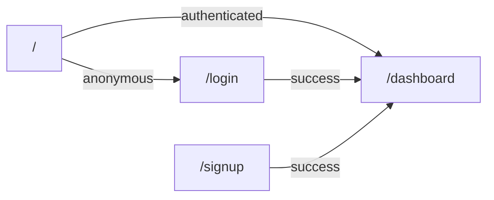
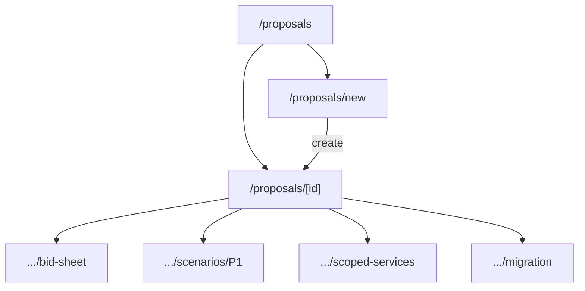

# Appendix: Page Relationships & Navigation

## Global shell

Authenticated app routes use a **sidebar** (`AppSidebar`) with:

- Dashboard → `/dashboard`
- Proposals → `/proposals`
- Reports → `/reports`
- Customers → `/customers`
- **Admin** section (if admin): Rate Cards, Service Hours, Customers, Users, Change Log, Theme

Footer shows signed-in email and **Sign out**.

## Entry & auth flows

Middleware redirects unauthenticated users from protected routes to `/login`; authenticated users hitting `/login` or `/signup` go to `/dashboard`.

## Proposal subgraph

**Inbound:** Dashboard recent cards, Proposals list, direct URL.

**Outbound:** Any tab link above; delete success → `/proposals`.

## Reports hub

`/reports` links only — each report is standalone with filters and optional Excel export.

## Admin subgraph

`/admin` links to child tools. Non-admins hitting any `/admin/*` URL are redirected to `/dashboard`.

## Data coupling notes

- Editing **rate cards** or **service hours** affects scenario grid pricing for all proposals using active catalog rows.
- **Bid sheet** and **Summary** depend on scenario totals, scoped lines, migration computation, and bid_sheet discounts — changes in sub-pages refresh after navigation/revalidation.
- **Portfolio / Proposal Log** reports pull from `proposal_revenue_report_base` view and migration aggregation helpers — underlying proposal edits change report output on next run.
